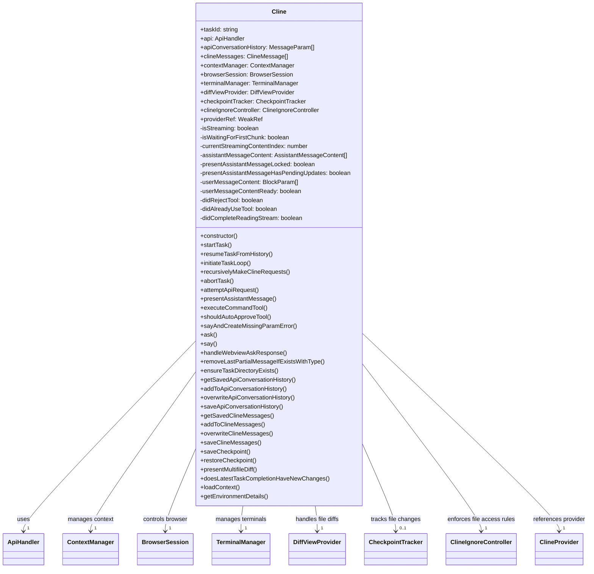
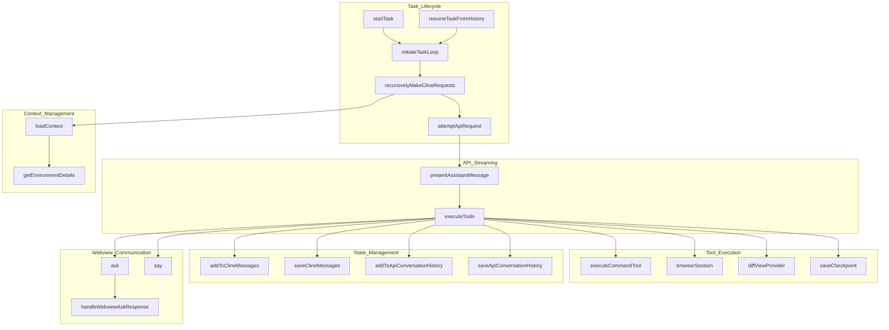
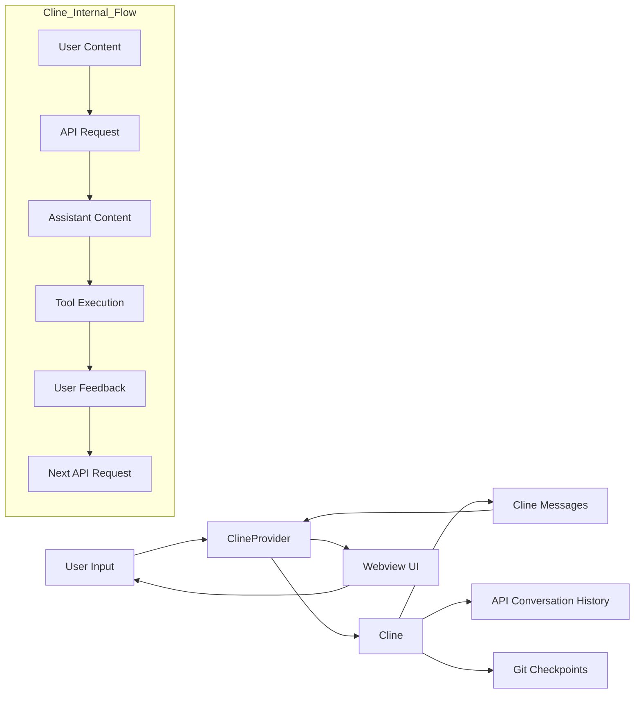
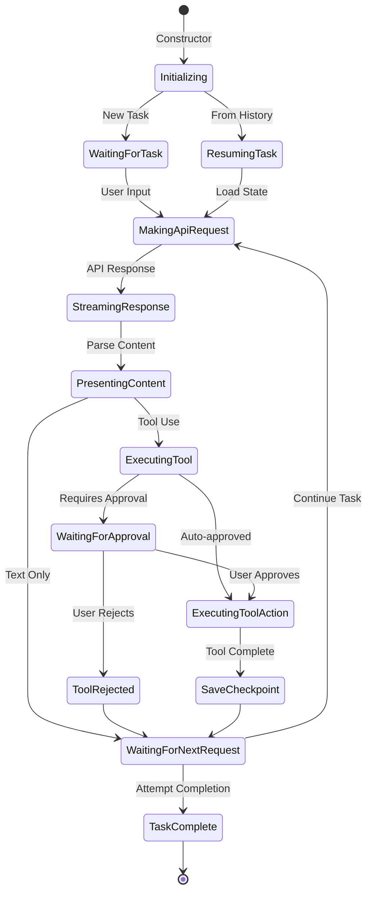

# Cline Class Architecture Diagram

## Key Interactions

## Data Flow

## State Transitions

## Diagram Explanation

The diagrams above illustrate the architecture and behavior of the Cline class, which is the core component of the VSCode extension:

1. **Class Diagram**: Shows the main properties and methods of the Cline class, organized by functional categories:
   - Core properties for state management
   - Streaming state variables for handling real-time content
   - Task lifecycle methods
   - API and streaming methods
   - Tool execution methods
   - Webview communication methods
   - State persistence methods
   - Checkpoint management methods
   - Context management methods

2. **Key Interactions**: Visualizes how different components of the Cline class interact with each other, showing the flow of execution from task initiation to tool execution and state management.

3. **Data Flow**: Illustrates how data moves through the system, from user input through the Cline class to various storage mechanisms and back to the user interface.

4. **State Transitions**: Maps the different states that a Cline instance can be in during its lifecycle, from initialization to task completion, including the various paths for tool execution and approval.

These diagrams provide a comprehensive view of how the Cline class orchestrates the extension's functionality, manages state, and coordinates between the core extension and the webview UI.
