# Cline Extension Architecture Diagram

```mermaid
graph TB
    %% Core Extension Components
    subgraph CoreExtension["Core Extension"]
        extension["extension.ts<br/>- activate()<br/>- deactivate()"]
        subgraph ClineProviderModule["ClineProvider"]
            ClineProvider["ClineProvider<br/>MANAGES STATE & UI<br/>- taskId<br/>- apiConfiguration<br/>- customInstructions<br/>- autoApprovalSettings<br/>- browserSettings<br/>- chatSettings"]
            ClineProviderCommands["Commands<br/>- plusButtonClicked()<br/>- mcpButtonClicked()<br/>- settingsButtonClicked()<br/>- historyButtonClicked()<br/>- accountButtonClicked()<br/>- popoutButtonClicked()"]
            ClineProviderState["State Management<br/>- getState()<br/>- updateGlobalState()<br/>- storeSecret()<br/>- getSecret()<br/>- updateApiConfiguration()<br/>- updateCustomInstructions()<br/>- getStateToPostToWebview()"]
            ClineProviderTasks["Task Management<br/>- initClineWithTask()<br/>- initClineWithHistoryItem()<br/>- clearTask()<br/>- cancelTask()<br/>- getTaskWithId()<br/>- updateTaskHistory()<br/>- deleteTaskWithId()<br/>- deleteAllTaskHistory()"]
            ClineProviderWebview["Webview Management<br/>- resolveWebviewView()<br/>- getHtmlContent()<br/>- setWebviewMessageListener()<br/>- postMessageToWebview()<br/>- postStateToWebview()"]
        end
        
        subgraph ClineModule["Cline"]
            Cline["Cline<br/>EXECUTES TASKS<br/>- taskId<br/>- api<br/>- apiConversationHistory<br/>- clineMessages<br/>- autoApprovalSettings<br/>- browserSettings<br/>- chatSettings"]
            ClineTaskExecution["Task Execution<br/>- initiateTaskLoop()<br/>- recursivelyMakeClineRequests()<br/>- fetchAndStreamCompletion()<br/>- presentAssistantMessage()"]
            ClineToolExecution["Tool Execution<br/>- executeToolWithApproval()<br/>- executeCommandTool()<br/>- executeFileTool()<br/>- executeBrowserAction()<br/>- executeMcpTool()"]
            ClineContextManagement["Context Management<br/>- prepareApiConversationHistory()<br/>- addMessageToApiConversationHistory()<br/>- saveApiConversationHistory()"]
            ClineErrorHandling["Error Handling<br/>- handleError()<br/>- abortTask()<br/>- recordErrorMetric()"]
            ClineCheckpoints["Checkpoint Management<br/>- saveCheckpoint()<br/>- restoreCheckpoint()<br/>- presentMultifileDiff()"]
        end
    end
    
    %% Webview UI Components
    subgraph WebviewUI["Webview UI"]
        subgraph WebviewAppModule["App Components"]
            WebviewApp["App.tsx<br/>MAIN COMPONENT<br/>- routes<br/>- layout"]
            WebviewChat["Chat View<br/>- messages<br/>- inputBox<br/>- sendMessage()"]
            WebviewSettings["Settings View<br/>- apiConfigurations<br/>- updateSettings()"]
            WebviewHistory["History View<br/>- taskHistory<br/>- selectTask()"]
            WebviewMcp["MCP View<br/>- mcpServers<br/>- mcpMarketplace<br/>- toggleServer()"]
        end
        
        subgraph ExtensionStateModule["Extension State"]
            ExtensionStateContext["ExtensionStateContext<br/>MANAGES UI STATE<br/>- state<br/>- didHydrateState<br/>- showWelcome<br/>- theme<br/>- openRouterModels<br/>- openAiModels<br/>- mcpServers<br/>- filePaths"]
            ExtensionStateContextProps["State & Methods<br/>- setApiConfiguration()<br/>- setCustomInstructions()<br/>- setShowAnnouncement()<br/>- setTelemetrySetting()<br/>- handleMessage()"]
            MessageHandling["Message Handling<br/>- handleMessage()<br/>- handlePartialMessage()<br/>- updateMessage()"]
        end
    end
    
    %% Services
    subgraph Services["Services"]
        subgraph APIModule["API"]
            ApiHandler["ApiHandler<br/>ABSTRACT API<br/>- createChatCompletionStream()<br/>- cancelRequest()<br/>- getModelInfo()"]
            AnthropicHandler["AnthropicHandler<br/>- anthropicClient<br/>- createChatCompletionStream()"]
            OpenAIHandler["OpenAIHandler<br/>- openAIClient<br/>- createChatCompletionStream()"]
            OpenRouterHandler["OpenRouterHandler<br/>- openRouterClient<br/>- createChatCompletionStream()"]
            BedrockHandler["BedrockHandler<br/>- bedrockClient<br/>- createChatCompletionStream()"]
            OtherProviders["Other API Providers<br/>(20+ providers)"]
        end
        
        subgraph MCPModule["MCP"]
            McpHub["McpHub<br/>MCP SERVER MANAGER<br/>- connections<br/>- isConnecting<br/>- getServers()<br/>- getMode()"]
            McpConnection["MCP Connection<br/>- server<br/>- client<br/>- transport"]
            McpServerConfig["MCP Server Config<br/>- command<br/>- args<br/>- env<br/>- autoApprove<br/>- disabled<br/>- timeout"]
            McpTools["MCP Tools<br/>- listTools()<br/>- callTool()<br/>- getToolSchema()"]
            McpResources["MCP Resources<br/>- listResources()<br/>- readResource()<br/>- listResourceTemplates()"]
        end
        
        subgraph BrowserModule["Browser"]
            BrowserSession["BrowserSession<br/>BROWSER AUTOMATION<br/>- browser<br/>- page<br/>- resolution<br/>- launchBrowser()<br/>- click()<br/>- type()<br/>- screenshot()<br/>- closeBrowser()"]
            UrlContentFetcher["UrlContentFetcher<br/>- fetchContent()<br/>- extractTextFromUrl()"]
        end
        
        subgraph TerminalModule["Terminal"]
            TerminalManager["TerminalManager<br/>TERMINAL OPERATIONS<br/>- terminals<br/>- getOrCreateTerminal()<br/>- runCommand()<br/>- handleTerminalExitCode()"]
        end
        
        subgraph IntegrationModule["Integrations"]
            CheckpointTracker["CheckpointTracker<br/>GIT-BASED TRACKING<br/>- git<br/>- repoPath<br/>- commit()<br/>- getCommitInfo()<br/>- getDiff()"]
            DiffViewProvider["DiffViewProvider<br/>VISUALIZE CHANGES<br/>- revertChanges()<br/>- showDiff()<br/>- multifileDiff()"]
            WorkspaceTracker["WorkspaceTracker<br/>WORKSPACE MONITOR<br/>- filePaths<br/>- populateFilePaths()<br/>- updateOnFileChange()"]
        end
        
        subgraph UtilModule["Utilities"]
            FileUtils["File Utils<br/>- fileExistsAtPath()<br/>- isDirectory()<br/>- extractTextFromFile()"]
            PathUtils["Path Utils<br/>- getReadablePath()<br/>- arePathsEqual()"]
            CostUtils["Cost Utils<br/>- calculateApiCost()<br/>- getApiMetrics()"]
        end
        
        subgraph AccountModule["Account"]
            ClineAccountService["ClineAccountService<br/>USER ACCOUNT<br/>- fetchBalance()<br/>- fetchUsageTransactions()<br/>- fetchPaymentTransactions()"]
            TelemetryService["TelemetryService<br/>- updateTelemetryState()<br/>- captureModeSwitch()<br/>- captureCompletion()"]
        end
    end
    
    %% Storage
    subgraph Storage["Storage"]
        GlobalState["VSCode Global State<br/>- apiConfiguration<br/>- customInstructions<br/>- taskHistory<br/>- autoApprovalSettings<br/>- chatSettings"]
        SecretsStorage["VSCode Secrets Storage<br/>- apiKeys<br/>- tokens<br/>- credentials"]
        TaskStorage["Task Storage<br/>- apiConversationHistory<br/>- uiMessages<br/>- checkpoints"]
        CheckpointStorage["Git-based Checkpoints<br/>- fileSnapshots<br/>- commitHistory"]
    end
    
    %% Connections and Data Flow
    extension --> ClineProvider
    ClineProvider --> Cline
    
    ClineProviderCommands -.-> ClineProvider
    ClineProviderState -.-> ClineProvider
    ClineProviderTasks -.-> ClineProvider
    ClineProviderWebview -.-> ClineProvider
    
    ClineTaskExecution -.-> Cline
    ClineToolExecution -.-> Cline
    ClineContextManagement -.-> Cline
    ClineErrorHandling -.-> Cline
    ClineCheckpoints -.-> Cline
    
    WebviewApp --> ExtensionStateContext
    WebviewChat -.-> WebviewApp
    WebviewSettings -.-> WebviewApp
    WebviewHistory -.-> WebviewApp
    WebviewMcp -.-> WebviewApp
    
    ExtensionStateContextProps -.-> ExtensionStateContext
    MessageHandling -.-> ExtensionStateContext
    
    %% Services connections
    Cline --> ApiHandler
    ApiHandler --> AnthropicHandler
    ApiHandler --> OpenAIHandler
    ApiHandler --> OpenRouterHandler
    ApiHandler --> BedrockHandler
    ApiHandler --> OtherProviders
    
    Cline --> TerminalManager
    Cline --> BrowserSession
    Cline --> CheckpointTracker
    Cline --> DiffViewProvider
    
    ClineProvider --> McpHub
    McpHub --> McpConnection
    McpConnection --> McpTools
    McpConnection --> McpResources
    McpHub -.-> McpServerConfig
    
    ClineProvider --> WorkspaceTracker
    ClineProvider --> ClineAccountService
    
    %% Storage connections
    ClineProvider --> GlobalState
    ClineProvider --> SecretsStorage
    Cline --> TaskStorage
    CheckpointTracker --> CheckpointStorage
    
    %% Bidirectional communication
    ClineProvider <--postMessage--> ExtensionStateContext
    
    %% Tool execution flow
    Cline -- "executeToolWithApproval()" --> ClineToolExecution
    ClineToolExecution -- "executeCommandTool()" --> TerminalManager
    ClineToolExecution -- "executeFileTool()" --> FileUtils
    ClineToolExecution -- "executeBrowserAction()" --> BrowserSession
    ClineToolExecution -- "executeMcpTool()" --> McpHub
    
    %% Message flow
    ExtensionStateContext -- "handleMessage()" --> MessageHandling
    ClineProvider -- "setWebviewMessageListener()" --> ClineProviderWebview
    
    %% Checkpoint flow
    Cline -- "saveCheckpoint()" --> CheckpointTracker
    Cline -- "presentMultifileDiff()" --> DiffViewProvider
    
    %% Data flow with Storage
    ClineProvider -- "getState()" --> GlobalState
    ClineProvider -- "getSecret()" --> SecretsStorage
    Cline -- "saveApiConversationHistory()" --> TaskStorage
    
    %% Task management flow
    ClineProvider -- "initClineWithTask()" --> Cline
    Cline -- "initiateTaskLoop()" --> ClineTaskExecution
    
    %% Style settings
    classDef primary fill:#d0e0ff,stroke:#333,stroke-width:1px
    classDef secondary fill:#e0f0ff,stroke:#333,stroke-width:1px
    classDef module fill:#f5f5f5,stroke:#666,stroke-width:1px,stroke-dasharray: 5 5
    
    class ClineProvider,Cline,ExtensionStateContext,ApiHandler,McpHub,BrowserSession,TerminalManager,CheckpointTracker primary
    class ClineProviderCommands,ClineProviderState,ClineProviderTasks,ClineProviderWebview,ClineTaskExecution,ClineToolExecution,ClineContextManagement,ClineErrorHandling,ClineCheckpoints secondary
    class ClineProviderModule,ClineModule,WebviewAppModule,ExtensionStateModule,APIModule,MCPModule,BrowserModule,TerminalModule,IntegrationModule,UtilModule,AccountModule module
```

The diagram above presents a comprehensive architecture of the Cline VSCode extension, showing the relationships between components, their methods, and the data flow between them. Key components include:

1. **Core Extension**:
   - `extension.ts`: The entry point that registers commands and activates the extension
   - `ClineProvider`: Manages state, UI interaction, and coordinates between components
   - `Cline`: Handles task execution, API interactions, and tool execution

2. **Webview UI**:
   - `App.tsx`: Main React component for the UI
   - `ExtensionStateContext`: React context that maintains UI state and synchronizes with the core

3. **Services**:
   - API Handlers: Various providers for different LLM APIs (Anthropic, OpenAI, etc.)
   - MCP Hub: Manages Model Context Protocol server connections
   - Browser Session: Handles browser automation
   - Terminal Manager: Manages terminal instances and commands
   - Checkpoint Tracker: Git-based tracking of file changes

4. **Storage**:
   - VSCode Global State: For settings and cross-session persistence
   - Secrets Storage: For API keys and sensitive information
   - Task Storage: Files for persistent task history
   - Git-based Checkpoints: For tracking and restoring file changes

The bidirectional communication between the Core Extension and Webview UI happens through VSCode's message passing system. The core maintains the single source of truth for the extension's state, while the webview provides the user interface and handles user interactions.
