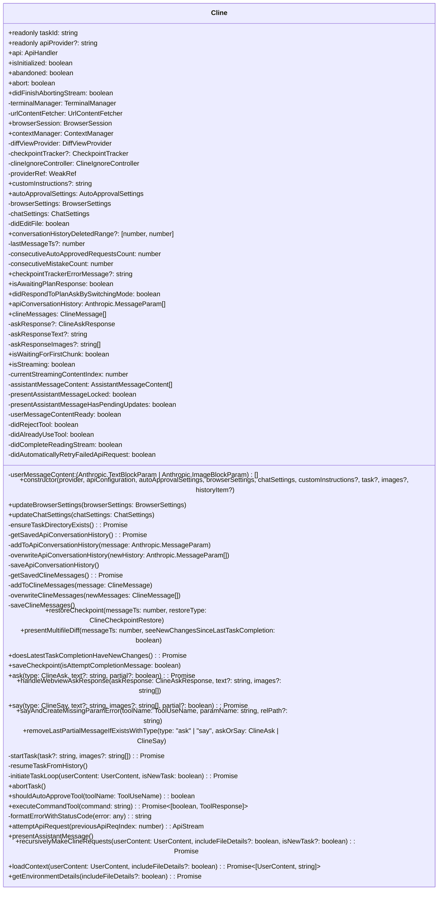

# Cline Class Diagram

The Cline class is the core component of the VSCode extension, handling task execution, state persistence, and tool coordination. Each task runs in its own instance of the Cline class, ensuring isolation and proper state management.

## Properties Explained

### Core Properties

- **taskId**: Unique identifier for the current task, used for persistence and tracking
- **apiProvider**: Name of the AI provider (Anthropic, OpenAI, etc.)
- **api**: Handler for API interactions with the LLM
- **isInitialized**: Flag indicating whether the Cline instance is fully initialized
- **abandoned**: Flag indicating if task was abandoned
- **abort**: Flag to control task abortion
- **didFinishAbortingStream**: Flag indicating if stream abortion is complete

### Managers & Services

- **terminalManager**: Manages terminal instances for command execution
- **urlContentFetcher**: Fetches content from URLs
- **browserSession**: Manages browser automation via Puppeteer
- **contextManager**: Manages conversation context and truncation
- **diffViewProvider**: Handles file diffs in the IDE
- **checkpointTracker**: Manages Git-based checkpoints for file changes
- **clineIgnoreController**: Controls which files/paths to ignore
- **providerRef**: Reference to the ClineProvider that owns this instance

### Settings

- **customInstructions**: Optional user-provided custom instructions
- **autoApprovalSettings**: Settings for auto-approving tools
- **browserSettings**: Configuration for browser automation
- **chatSettings**: Settings for chat behavior and mode

### State Tracking

- **didEditFile**: Tracks if a file was edited (for terminal cooldown)
- **conversationHistoryDeletedRange**: Tracks which messages were truncated
- **lastMessageTs**: Timestamp of last message
- **consecutiveAutoApprovedRequestsCount**: Count of consecutive auto-approved requests
- **consecutiveMistakeCount**: Count of consecutive model mistakes
- **checkpointTrackerErrorMessage**: Error message for checkpoint issues
- **isAwaitingPlanResponse**: Flag for plan mode response status
- **didRespondToPlanAskBySwitchingMode**: Flag for mode switching

### Message Storage

- **apiConversationHistory**: History of API messages for context window
- **clineMessages**: Messages for the Cline UI
- **askResponse**: Response to the last ask operation
- **askResponseText**: Text content of the last ask response
- **askResponseImages**: Image content of the last ask response

### Streaming State

- **isWaitingForFirstChunk**: Flag indicating waiting for first API chunk
- **isStreaming**: Flag indicating if streaming is in progress
- **currentStreamingContentIndex**: Current index in streaming content
- **assistantMessageContent**: Parsed content blocks from assistant
- **presentAssistantMessageLocked**: Lock to prevent race conditions in message presentation
- **presentAssistantMessageHasPendingUpdates**: Flag for pending message updates
- **userMessageContent**: Content to send back to API in next turn
- **userMessageContentReady**: Flag indicating if user content is ready
- **didRejectTool**: Flag indicating if user rejected a tool
- **didAlreadyUseTool**: Flag indicating if a tool was already used in this message
- **didCompleteReadingStream**: Flag indicating if stream is complete
- **didAutomaticallyRetryFailedApiRequest**: Flag for API retry status

## Methods Explained

### Constructor & Settings Update

- **constructor**: Initializes a new Cline instance either with a new task or from history
  - Input: Provider reference, API config, settings, optional task/images/history
  - Output: Initialized Cline instance
  - Purpose: Create a new task or resume an existing one
  
- **updateBrowserSettings**: Updates browser automation settings
  - Input: New BrowserSettings object
  - Purpose: Apply new browser settings during task execution
  
- **updateChatSettings**: Updates chat behavior settings
  - Input: New ChatSettings object
  - Purpose: Apply new chat settings during task execution

### Task Storage Methods

- **ensureTaskDirectoryExists**: Creates and returns task storage directory
  - Output: Path to task directory
  - Purpose: Ensure persistent storage for the task exists
  
- **getSavedApiConversationHistory**: Loads API conversation history from disk
  - Output: Array of API messages
  - Purpose: Resume conversation context from storage
  
- **addToApiConversationHistory**: Adds a message to API history and persists it
  - Input: API message
  - Purpose: Track and persist conversation history
  
- **overwriteApiConversationHistory**: Replaces API history with new array
  - Input: New API history array
  - Purpose: Reset conversation context (e.g., after checkpoints)
  
- **saveApiConversationHistory**: Persists current API history to disk
  - Purpose: Ensure conversation can be resumed later
  
- **getSavedClineMessages**: Loads Cline UI messages from disk
  - Output: Array of Cline messages
  - Purpose: Resume UI state from storage
  
- **addToClineMessages**: Adds a message to UI history and persists it
  - Input: Cline message
  - Purpose: Track and persist UI state
  
- **overwriteClineMessages**: Replaces UI history with new array
  - Input: New Cline messages array
  - Purpose: Reset UI state (e.g., after checkpoints)
  
- **saveClineMessages**: Persists current UI messages to disk
  - Purpose: Ensure UI state can be resumed later, updates task history

### Checkpoint Methods

- **restoreCheckpoint**: Restores task to a previous checkpoint
  - Input: Message timestamp, restore type
  - Purpose: Reset task to previous state
  
- **presentMultifileDiff**: Shows diff of changes since a checkpoint
  - Input: Message timestamp, flag for comparison type
  - Purpose: Display changes visually to user
  
- **doesLatestTaskCompletionHaveNewChanges**: Checks if last completion changed files
  - Output: Boolean indicating if changes exist
  - Purpose: Determine if "see changes" button should be shown
  
- **saveCheckpoint**: Creates Git checkpoint of current workspace state
  - Input: Flag indicating if checkpoint is for task completion
  - Purpose: Create restoration point for workspace files

### Communication Methods

- **ask**: Sends a question to the user and awaits response
  - Input: Question type, text, partial flag
  - Output: User response with text/images
  - Purpose: Get user input or approval for actions
  
- **handleWebviewAskResponse**: Processes user response to an ask
  - Input: Response type, text, images
  - Purpose: Store user response for processing
  
- **say**: Sends a message to the user
  - Input: Message type, text, images, partial flag
  - Purpose: Display information or results to user
  
- **sayAndCreateMissingParamError**: Creates error for missing tool parameter
  - Input: Tool name, parameter name, optional path
  - Output: Formatted error response
  - Purpose: Handle incomplete tool calls gracefully
  
- **removeLastPartialMessageIfExistsWithType**: Removes last partial message of a type
  - Input: Message type, specific ask/say type
  - Purpose: Clean up incomplete messages when switching approaches

### Task Lifecycle Methods

- **startTask**: Begins a new task
  - Input: Optional task text and images
  - Purpose: Initialize and start a new task execution
  
- **resumeTaskFromHistory**: Resumes a task from saved history
  - Purpose: Continue execution of a previously started task
  
- **initiateTaskLoop**: Main task execution loop
  - Input: User content, new task flag
  - Purpose: Coordinate the agent loop of request and response
  
- **abortTask**: Aborts the current task
  - Purpose: Clean up resources and stop execution

### Tool Methods

- **shouldAutoApproveTool**: Determines if a tool should be auto-approved
  - Input: Tool name
  - Output: Boolean indicating if auto-approval applies
  - Purpose: Apply auto-approval settings
  
- **executeCommandTool**: Executes a command in the terminal
  - Input: Command string
  - Output: Boolean for user rejection, tool response
  - Purpose: Run CLI commands for the user

### API Request Methods

- **formatErrorWithStatusCode**: Formats API error with status code
  - Input: Error object
  - Output: Formatted error string
  - Purpose: Present API errors consistently
  
- **attemptApiRequest**: Sends request to AI API with retry logic
  - Input: Previous request index
  - Output: Stream of API responses
  - Purpose: Handle API communication with error recovery
  
- **presentAssistantMessage**: Presents assistant message parts with locking
  - Purpose: Display streaming content while preventing race conditions
  
- **recursivelyMakeClineRequests**: Makes recursive API requests
  - Input: User content, file details flag, new task flag
  - Output: Boolean indicating if loop should end
  - Purpose: Handle the conversation loop with the API

### Context Methods

- **loadContext**: Loads context for user content
  - Input: User content, file details flag
  - Output: Processed user content, environment details
  - Purpose: Enrich user content with context
  
- **getEnvironmentDetails**: Builds environment context string
  - Input: File details flag
  - Output: Formatted environment details
  - Purpose: Provide environmental context to the model
