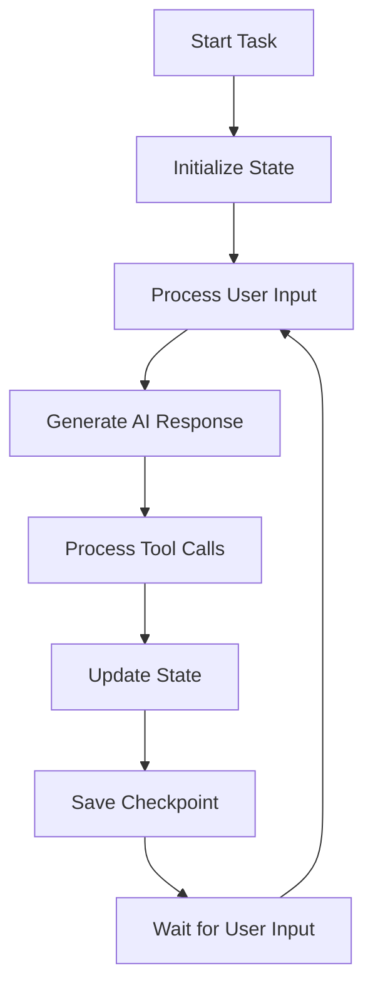
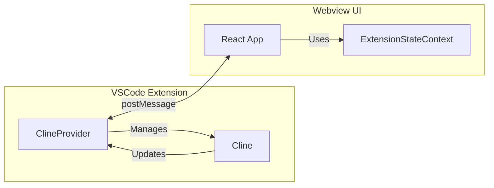

# Cline Core Classes

This document provides a detailed explanation of Cline's core classes: the `Cline` class and the `ClineProvider` class. These classes form the foundation of Cline's functionality.

## Cline Class

The `Cline` class is the heart of the extension, managing task execution, state persistence, and tool coordination. Each task runs in its own instance of the Cline class, ensuring isolation and proper state management.

### Core Responsibilities

1. **Task Execution**
   - Manages the task execution loop
   - Handles API communication
   - Coordinates tool execution
   - Maintains conversation state

2. **State Management**
   - Manages task-specific state
   - Handles file changes
   - Tracks conversation history
   - Maintains tool execution state

3. **Tool Coordination**
   - Executes file operations
   - Manages terminal commands
   - Handles browser automation
   - Coordinates tool approvals

### Key Methods

```typescript
class Cline {
    // Task Management
    async initiateTaskLoop(userContent: UserContent, isNewTask: boolean): Promise<void>
    async resumeTaskFromHistory(): Promise<void>
    async saveTaskState(): Promise<void>

    // Message Handling
    async presentAssistantMessage(): Promise<void>
    async handleUserMessage(message: string): Promise<void>

    // Tool Execution
    async executeToolWithApproval(block: ToolBlock): Promise<ToolResponse>
    async executeCommandTool(command: string): Promise<[boolean, ToolResponse]>
    async executeBrowserAction(action: BrowserAction): Promise<BrowserActionResult>

    // State Management
    private async saveCheckpoint(): Promise<void>
    private async loadState(): Promise<void>
    private async updateState(): Promise<void>
}
```

### Task Execution Flow



### State Management

```typescript
interface ClineState {
    messages: Message[]
    toolResults: ToolResult[]
    fileChanges: FileChange[]
    terminalOutput: string[]
    browserState: BrowserState
    checkpoint: string
}
```

### Error Handling

```typescript
class Cline {
    async handleError(action: string, error: Error): Promise<void> {
        // 1. Check if task was abandoned
        if (this.abandoned) return
        
        // 2. Format error message
        const errorString = `Error ${action}: ${error.message}`
        
        // 3. Present error to user
        await this.say("error", errorString)
        
        // 4. Add error to tool results
        pushToolResult(formatResponse.toolError(errorString))
        
        // 5. Cleanup resources
        await this.diffViewProvider.revertChanges()
        await this.browserSession.closeBrowser()
    }
}
```

## ClineProvider Class

The `ClineProvider` class manages the webview interface and serves as the bridge between the VS Code extension and the webview UI. It handles state persistence and coordinates communication between components.

### Core Responsibilities

1. **Webview Management**
   - Creates and manages webview instances
   - Handles webview lifecycle
   - Manages webview state
   - Coordinates UI updates

2. **State Management**
   - Manages global extension state
   - Handles workspace state
   - Manages secrets storage
   - Coordinates state updates

3. **Communication**
   - Handles message passing
   - Manages event handling
   - Coordinates state synchronization
   - Handles command execution

### Key Methods

```typescript
class ClineProvider {
    // Webview Management
    async createWebview(): Promise<void>
    async updateWebview(): Promise<void>
    async disposeWebview(): Promise<void>

    // State Management
    async updateState(newState: ExtensionState): Promise<void>
    async getState(): Promise<ExtensionState>
    async saveState(): Promise<void>

    // Communication
    async sendMessage(message: WebviewMessage): Promise<void>
    async handleMessage(message: WebviewMessage): Promise<void>
    async executeCommand(command: Command): Promise<void>
}
```

### State Management

```typescript
interface ExtensionState {
    version: string
    messages: Message[]
    taskHistory: Task[]
    theme: Theme
    apiConfig: ApiConfig
    mcpServers: McpServer[]
    marketplaceCatalog: MarketplaceItem[]
    workspaceFilePaths: string[]
}
```

### Message Handling

```typescript
class ClineProvider {
    private async handleMessage(message: WebviewMessage): Promise<void> {
        switch (message.type) {
            case MessageType.SEND_MESSAGE:
                await this.handleSendMessage(message.payload)
                break
            case MessageType.APPROVE_ACTION:
                await this.handleApproveAction(message.payload)
                break
            case MessageType.REJECT_ACTION:
                await this.handleRejectAction(message.payload)
                break
            case MessageType.UPDATE_SETTINGS:
                await this.handleUpdateSettings(message.payload)
                break
        }
    }
}
```

## Interaction Between Classes

### Data Flow



### State Synchronization

1. **Cline to ClineProvider**
   - Task state updates
   - Tool execution results
   - Error notifications
   - Progress updates

2. **ClineProvider to Webview**
   - State updates
   - UI updates
   - Command responses
   - Error messages

3. **Webview to ClineProvider**
   - User messages
   - Action approvals
   - Setting changes
   - Command requests

## Best Practices

### 1. State Management

- Keep state minimal and focused
- Use proper typing for all state
- Handle state updates atomically
- Implement proper error handling

### 2. Communication

- Use typed messages
- Handle all message types
- Implement proper error handling
- Maintain message order

### 3. Resource Management

- Clean up resources properly
- Handle disposal correctly
- Manage memory efficiently
- Implement proper error recovery

### 4. Error Handling

- Provide clear error messages
- Implement proper fallbacks
- Handle edge cases
- Maintain state consistency

## Common Patterns

### 1. Task Execution

```typescript
async function executeTask() {
    try {
        // 1. Initialize state
        await initializeState()
        
        // 2. Start task loop
        while (!aborted) {
            // 3. Process input
            await processInput()
            
            // 4. Generate response
            await generateResponse()
            
            // 5. Handle tools
            await handleTools()
            
            // 6. Update state
            await updateState()
        }
    } catch (error) {
        await handleError(error)
    }
}
```

### 2. State Updates

```typescript
async function updateState() {
    // 1. Prepare update
    const update = prepareStateUpdate()
    
    // 2. Apply update
    await applyStateUpdate(update)
    
    // 3. Notify webview
    await notifyWebview(update)
    
    // 4. Save state
    await saveState()
}
```

### 3. Message Handling

```typescript
async function handleMessage(message: WebviewMessage) {
    // 1. Validate message
    validateMessage(message)
    
    // 2. Process message
    const result = await processMessage(message)
    
    // 3. Update state
    await updateState(result)
    
    // 4. Send response
    await sendResponse(result)
}
```

## Conclusion

The `Cline` and `ClineProvider` classes work together to provide:
- Robust task execution
- Reliable state management
- Efficient communication
- Proper resource handling

Understanding these classes is essential for:
- Developing new features
- Debugging issues
- Contributing to the project
- Extending functionality 