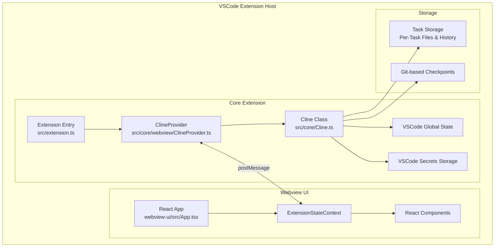

# Cline Architecture Overview

## Introduction

Cline is a VS Code extension that provides an AI-powered coding assistant using Claude 3.7 Sonnet. It combines a TypeScript-based core extension with a React-based webview UI to deliver a powerful and user-friendly development experience.

## Core Components

### 1. Extension Architecture



### 2. Core Components Description

#### Extension Entry (src/extension.ts)
- Main entry point for the VS Code extension
- Initializes the ClineProvider and registers commands
- Sets up event handlers and extension lifecycle management

#### ClineProvider (src/core/webview/ClineProvider.ts)
- Manages the webview interface
- Handles state management and persistence
- Coordinates communication between core extension and webview
- Manages API configurations and task history

#### Cline Class (src/core/Cline.ts)
- Core business logic implementation
- Handles task execution and tool management
- Manages file operations and terminal commands
- Implements checkpoint system for code changes

#### Webview UI
- React-based user interface
- Real-time updates and state synchronization
- Handles user interactions and command approvals
- Provides rich markdown and code rendering

## State Management

### 1. Core Extension State
- Managed by ClineProvider
- Persists across VS Code sessions
- Includes:
  - Global settings
  - API configurations
  - Task history
  - Workspace state
  - Secrets storage

### 2. Webview State
- Managed by ExtensionStateContext
- Includes:
  - Current task state
  - Messages and updates
  - UI theme settings
  - Real-time tool execution status

## Task Execution Flow

1. **Task Initiation**
   - User submits a request
   - ClineProvider creates new task instance
   - Task history is updated

2. **Context Analysis**
   - Code structure analysis
   - File system exploration
   - Relevant file content reading

3. **Tool Execution**
   - Tool selection based on task
   - User approval for actions
   - State updates and progress tracking

4. **State Persistence**
   - Checkpoint creation
   - Task history updates
   - File system changes tracking

## Security Features

### 1. File Access Control
- `.clineignore` support for excluding sensitive files
- Granular file operation permissions
- Secure file reading and writing

### 2. Command Execution Safety
- User approval required for all commands
- Command validation and sanitization
- Secure terminal session management

### 3. API Security
- Secure API key storage
- Token-based authentication
- Rate limiting and usage tracking

## Extension API

The extension provides a public API for other VS Code extensions:

```typescript
interface ClineAPI {
    // Task Management
    startNewTask(message: string, images?: string[]): Promise<void>
    sendMessage(message: string): Promise<void>

    // UI Control
    pressPrimaryButton(): Promise<void>
    pressSecondaryButton(): Promise<void>

    // Configuration
    setCustomInstructions(instructions: string): Promise<void>
    getCustomInstructions(): Promise<string>
}
```

## Tool System

### 1. Built-in Tools
- File operations (read, write, edit)
- Terminal command execution
- Code search and analysis
- Browser automation

### 2. MCP (Model Context Protocol)
- Custom tool creation
- Tool extension framework
- Dynamic capability expansion

## Error Handling

1. **Graceful Degradation**
   - Fallback mechanisms
   - Error recovery strategies
   - State restoration

2. **User Feedback**
   - Clear error messages
   - Recovery suggestions
   - Progress tracking

## Performance Considerations

1. **Resource Management**
   - Efficient file reading
   - Memory usage optimization
   - Context window management

2. **State Synchronization**
   - Optimized message passing
   - Minimal state updates
   - Efficient UI rendering

## Conclusion

Cline's architecture is designed for:
- Extensibility and modularity
- Secure and controlled AI assistance
- Efficient state management
- Reliable task execution
- User-friendly interaction

The combination of a robust core extension with a responsive webview UI enables Cline to provide powerful AI-assisted development capabilities while maintaining security and user control. 