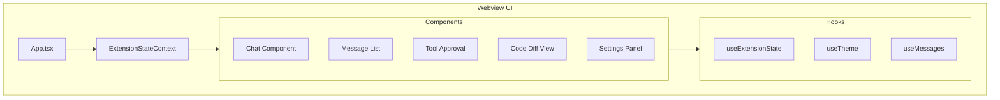

# Cline WebUI Implementation

## Overview

Cline's WebUI is built using React and TypeScript, providing a modern and responsive interface for interacting with the AI assistant. The UI is implemented as a VS Code webview, allowing seamless integration with the IDE while maintaining isolation and security.

## Architecture

### 1. Core Components



### 2. Directory Structure

```
webview-ui/
├── src/
│   ├── App.tsx                 # Main application component
│   ├── components/             # Reusable UI components
│   │   ├── Chat/              # Chat interface components
│   │   ├── CodeDiff/          # Code difference viewer
│   │   ├── Settings/          # Settings panel components
│   │   └── shared/            # Shared UI elements
│   ├── context/               # React context providers
│   ├── hooks/                 # Custom React hooks
│   ├── styles/                # Global styles and themes
│   └── utils/                 # Utility functions
├── public/                    # Static assets
└── vite.config.ts            # Build configuration
```

## Core Features

### 1. Chat Interface

```typescript
interface ChatProps {
    messages: Message[]
    onSendMessage: (message: string) => void
    onApproveAction: (actionId: string) => void
    onRejectAction: (actionId: string) => void
}

const Chat: React.FC<ChatProps> = ({
    messages,
    onSendMessage,
    onApproveAction,
    onRejectAction
}) => {
    // Chat component implementation
}
```

Key features:
- Real-time message updates
- Markdown rendering
- Code syntax highlighting
- Image attachment support
- Tool execution approval UI

### 2. Code Diff Viewer

```typescript
interface CodeDiffProps {
    originalCode: string
    modifiedCode: string
    filePath: string
    onApprove: () => void
    onReject: () => void
}

const CodeDiff: React.FC<CodeDiffProps> = ({
    originalCode,
    modifiedCode,
    filePath,
    onApprove,
    onReject
}) => {
    // Code diff implementation
}
```

Features:
- Side-by-side diff view
- Syntax highlighting
- Line number display
- Change indicators
- Approval/rejection controls

### 3. Extension State Context

```typescript
interface ExtensionState {
    messages: Message[]
    taskHistory: Task[]
    settings: Settings
    theme: Theme
    apiConfig: ApiConfig
}

const ExtensionStateContext = React.createContext<{
    state: ExtensionState
    dispatch: (action: Action) => void
}>({
    state: initialState,
    dispatch: () => null
})
```

State management:
- Global state container
- Action dispatching
- State persistence
- Real-time updates

## Communication Protocol

### 1. Message Types

```typescript
interface WebviewMessage {
    type: MessageType
    payload: unknown
}

enum MessageType {
    SEND_MESSAGE = 'send_message',
    APPROVE_ACTION = 'approve_action',
    REJECT_ACTION = 'reject_action',
    UPDATE_SETTINGS = 'update_settings',
    STATE_UPDATE = 'state_update'
}
```

### 2. Event Handling

```typescript
class MessageHandler {
    private vscode: WebviewApi

    constructor() {
        this.vscode = acquireVsCodeApi()
        window.addEventListener('message', this.handleMessage)
    }

    private handleMessage = (event: MessageEvent<WebviewMessage>) => {
        const { type, payload } = event.data
        switch (type) {
            case MessageType.STATE_UPDATE:
                this.handleStateUpdate(payload)
                break
            // Handle other message types
        }
    }
}
```

## UI Components

### 1. Message Components

- `MessageList`: Displays chat messages
- `MessageItem`: Individual message rendering
- `CodeBlock`: Code syntax highlighting
- `MarkdownRenderer`: Markdown content display
- `ImagePreview`: Image attachment viewer

### 2. Tool Components

- `ToolApproval`: Action approval interface
- `TerminalPreview`: Terminal command preview
- `FileTree`: File system navigation
- `SearchResults`: Code search display

### 3. Settings Components

- `SettingsPanel`: Configuration interface
- `ApiKeyInput`: API key management
- `ThemeSelector`: UI theme selection
- `ProviderConfig`: Provider settings

## Styling System

### 1. Theme Implementation

```typescript
interface Theme {
    colors: {
        primary: string
        secondary: string
        background: string
        text: string
        border: string
        // Additional color tokens
    }
    spacing: {
        small: string
        medium: string
        large: string
    }
    typography: {
        fontSize: {
            small: string
            medium: string
            large: string
        }
        fontFamily: {
            body: string
            code: string
        }
    }
}
```

### 2. Component Styling

```typescript
const StyledComponent = styled.div<Props>`
    background: ${props => props.theme.colors.background};
    padding: ${props => props.theme.spacing.medium};
    font-family: ${props => props.theme.typography.fontFamily.body};
    // Additional styling
`
```

## Performance Optimization

### 1. Message Rendering

- Virtual scrolling for large message lists
- Lazy loading of images
- Code syntax highlighting optimization
- Markdown rendering caching

### 2. State Updates

- Debounced state updates
- Selective re-rendering
- Memoized components
- Efficient context usage

### 3. Resource Management

- Image optimization
- Code splitting
- Bundle size optimization
- Asset preloading

## Accessibility

### 1. Keyboard Navigation

- Focus management
- Keyboard shortcuts
- Tab order optimization
- ARIA attributes

### 2. Screen Reader Support

- Semantic HTML
- ARIA labels
- Alternative text
- Role attributes

## Error Handling

### 1. UI Error Boundaries

```typescript
class ErrorBoundary extends React.Component<Props, State> {
    static getDerivedStateFromError(error: Error) {
        return { hasError: true, error }
    }

    componentDidCatch(error: Error, errorInfo: React.ErrorInfo) {
        // Log error to monitoring service
    }

    render() {
        if (this.state.hasError) {
            return <ErrorFallback error={this.state.error} />
        }
        return this.props.children
    }
}
```

### 2. Error States

- Loading states
- Error messages
- Retry mechanisms
- Fallback UI

## Testing

### 1. Component Testing

```typescript
describe('Chat Component', () => {
    it('renders messages correctly', () => {
        const messages = [/* test messages */]
        render(<Chat messages={messages} />)
        // Assertions
    })

    it('handles message sending', () => {
        const onSendMessage = jest.fn()
        render(<Chat onSendMessage={onSendMessage} />)
        // Test message sending
    })
})
```

### 2. Integration Testing

- State management testing
- Communication testing
- Event handling testing
- UI flow testing

## Best Practices

### 1. Component Design

- Single responsibility
- Proper prop typing
- Error handling
- Performance optimization

### 2. State Management

- Minimal state
- Proper context usage
- Action creators
- State selectors

### 3. Testing

- Unit tests
- Integration tests
- Accessibility tests
- Performance tests

## Conclusion

Cline's WebUI implementation provides:
- Modern and responsive interface
- Efficient state management
- Robust error handling
- Accessible design
- Optimized performance

The combination of React, TypeScript, and VS Code's webview API creates a powerful and user-friendly interface for AI-assisted development. 